```python
# Classifiers comparison: decision trees and k-nearest neighbors on the dataset Iris
```


```python
import numpy as np
from matplotlib import pyplot as plt
from sklearn import tree
from sklearn.datasets import load_iris
from sklearn.model_selection import cross_val_score, train_test_split
from sklearn import neighbors
from lab_2_utils import print_decorated
from scipy import stats
import warnings
warnings.simplefilter(action='ignore', category=FutureWarning)
```


```python
# DecisionTreeClassifier: Review, Cross Validation and accuracy scores
iris = load_iris()
clf = tree.DecisionTreeClassifier(
    criterion="entropy",
    random_state=300,
    min_samples_leaf=5,
    class_weight={0: 1, 1: 1, 2: 1})
accuracy_scores = cross_val_score(clf, iris.data, iris.target, cv=5)
print_decorated('Decision Tree Classifier - accuracy scores', accuracy_scores)
```

    
    #######################################################################################
    Decision Tree Classifier - accuracy scores :  [0.96666667 1.         0.86666667 0.86666667 1.        ]
    


```python
"""
k-NN: KNeighborsClassifier: uniform weights
Cross Validation and accuracy scores
"""
n_neighbors = 11
clf_knn = neighbors.KNeighborsClassifier(n_neighbors, weights='uniform')
clf_knn = clf_knn.fit(iris.data, iris.target)
accuracy_scores = cross_val_score(clf_knn, iris.data, iris.target, cv=5)
print_decorated('k-NN with uniform weights:  accuracy scores', accuracy_scores)

# print FALSE predictions: 4 errors
print_decorated("Shows the Error model predictions", 0)
for i in range(len(iris.target)):  # for each example in dataset (150)
    instance = iris.data[i, :].reshape(1, -1)  # e.g. [[5.1 3.5 1.4 0.2]]
    predicted = clf_knn.predict(instance)[0]  # e.g. 0 (predicted class)
    if iris.target[i] != predicted:
        print("Instance: #", str(i), " - ", instance)
        print("Predicted class: ", predicted)
        print("Predicted ko\n" + "True class: " +
              str(iris.target_names[iris.target[i]])
              + "; predicted: " + str(iris.target_names[predicted]))
        print('#######################################################################################')

```

    
    #######################################################################################
    k-NN with uniform weights:  accuracy scores :  [0.93333333 1.         1.         0.96666667 1.        ]
    
    #######################################################################################
    Shows the Error model predictions :  0
    Instance: # 77  -  [[6.7 3.  5.  1.7]]
    Predicted class:  2
    Predicted ko
    True class: versicolor; predicted: virginica
    #######################################################################################
    Instance: # 83  -  [[6.  2.7 5.1 1.6]]
    Predicted class:  2
    Predicted ko
    True class: versicolor; predicted: virginica
    #######################################################################################
    Instance: # 106  -  [[4.9 2.5 4.5 1.7]]
    Predicted class:  1
    Predicted ko
    True class: virginica; predicted: versicolor
    #######################################################################################
    Instance: # 138  -  [[6.  3.  4.8 1.8]]
    Predicted class:  1
    Predicted ko
    True class: virginica; predicted: versicolor
    #######################################################################################
    


```python
"""
k-NN: KNeighborsClassifier: distance weights
Cross Validation and accuracy scores
"""
n_neighbors = 11
clf_knn2 = neighbors.KNeighborsClassifier(n_neighbors, weights='distance')
clf_knn2.fit(iris.data, iris.target)
accuracy_scores_knn_distance_weights = cross_val_score(clf_knn2,
                                                       iris.data,
                                                       iris.target,
                                                       cv=5,
                                                       scoring='accuracy')
print_decorated('k-NN with distance weights: accuracy scores',
                accuracy_scores_knn_distance_weights)
# print FALSE predictions: 0 errors
for i in range(len(iris.target)):
    instance = (iris.data[i, :]).reshape(1, -1)
    predicted_knn_distance_weights = clf_knn2.predict(instance)[0]
    if iris.target[i] != predicted_knn_distance_weights:
        print(str(i) + " nok " + "true class: " + str(iris.target_names[iris.target[i]]) + "; predicted: " + str(
            iris.target_names[predicted_knn_distance_weights]))
```

    
    #######################################################################################
    k-NN with distance weights: accuracy scores :  [0.96666667 1.         1.         0.96666667 1.        ]
    


```python
"""
TUNING k PARAMETER (K = key: neighbors)
Find the best value of k (maximum accuracy)
"""
print_decorated("TUNING k PARAMETER (K = key: neighbors)", "Find the best value of k (maximum accuracy)")
# split dataset to training set and test set
X_train, X_test, y_train, y_test = train_test_split(iris.data, iris.target, test_size=0.4, random_state=0)
# init best_accuracy and best_k
best_accuracy = 0
best_k = 1
# array for store accuracies
# for each example of training set, you want a value of accuracy
# len(y_train) = 90
# init with array of 90 elements with value = 0
Accuracy_array = np.zeros(len(y_train), dtype=float)
print("init Accuracy Array\n", Accuracy_array)
print("-------------------------------------------------------------------------")
# all k neighbors to test (from 1 neighbors to 90 neighbors)
print("init k neighbors Array (k = 1, k = 2, ..., k = 90)\n", Accuracy_array)
print(np.arange(1, len(y_train) + 1))
print("-------------------------------------------------------------------------")
for n_neighbors in np.arange(1, len(y_train) + 1):
    # k-nn classification, model fitting, accuracy scoring and save to accuracy_array
    clf_knn3 = neighbors.KNeighborsClassifier(n_neighbors, weights='distance')
    clf_knn3.fit(X_train, y_train)
    # save accuracy in Accuracy_array
    index = n_neighbors - 1
    Accuracy_array[index] = clf_knn3.score(X_test, y_test)
    # update best_accuracy and best_k if best_accuracy
    if best_accuracy < clf_knn3.score(X_test, y_test):
        best_accuracy = clf_knn3.score(X_test, y_test)
        best_k = n_neighbors

print("k neighbors Array after tuning (k = 1, k = 2, ..., k = 90)\n", Accuracy_array)
print("-------------------------------------------------------------------------")
print("best k="+str(best_k))  # k = 7 = best split
print("best accuracy="+str(best_accuracy))  # best accuracy = 0.9666666666666667
```

    
    #######################################################################################
    TUNING k PARAMETER (K = key: neighbors) :  Find the best value of k (maximum accuracy)
    init Accuracy Array
     [0. 0. 0. 0. 0. 0. 0. 0. 0. 0. 0. 0. 0. 0. 0. 0. 0. 0. 0. 0. 0. 0. 0. 0.
     0. 0. 0. 0. 0. 0. 0. 0. 0. 0. 0. 0. 0. 0. 0. 0. 0. 0. 0. 0. 0. 0. 0. 0.
     0. 0. 0. 0. 0. 0. 0. 0. 0. 0. 0. 0. 0. 0. 0. 0. 0. 0. 0. 0. 0. 0. 0. 0.
     0. 0. 0. 0. 0. 0. 0. 0. 0. 0. 0. 0. 0. 0. 0. 0. 0. 0.]
    -------------------------------------------------------------------------
    init k neighbors Array (k = 1, k = 2, ..., k = 90)
     [0. 0. 0. 0. 0. 0. 0. 0. 0. 0. 0. 0. 0. 0. 0. 0. 0. 0. 0. 0. 0. 0. 0. 0.
     0. 0. 0. 0. 0. 0. 0. 0. 0. 0. 0. 0. 0. 0. 0. 0. 0. 0. 0. 0. 0. 0. 0. 0.
     0. 0. 0. 0. 0. 0. 0. 0. 0. 0. 0. 0. 0. 0. 0. 0. 0. 0. 0. 0. 0. 0. 0. 0.
     0. 0. 0. 0. 0. 0. 0. 0. 0. 0. 0. 0. 0. 0. 0. 0. 0. 0.]
    [ 1  2  3  4  5  6  7  8  9 10 11 12 13 14 15 16 17 18 19 20 21 22 23 24
     25 26 27 28 29 30 31 32 33 34 35 36 37 38 39 40 41 42 43 44 45 46 47 48
     49 50 51 52 53 54 55 56 57 58 59 60 61 62 63 64 65 66 67 68 69 70 71 72
     73 74 75 76 77 78 79 80 81 82 83 84 85 86 87 88 89 90]
    -------------------------------------------------------------------------
    k neighbors Array after tuning (k = 1, k = 2, ..., k = 90)
     [0.91666667 0.91666667 0.93333333 0.91666667 0.95       0.93333333
     0.96666667 0.93333333 0.96666667 0.96666667 0.96666667 0.96666667
     0.96666667 0.95       0.95       0.91666667 0.93333333 0.91666667
     0.91666667 0.91666667 0.91666667 0.91666667 0.91666667 0.9
     0.91666667 0.91666667 0.93333333 0.93333333 0.93333333 0.91666667
     0.93333333 0.91666667 0.93333333 0.91666667 0.93333333 0.91666667
     0.93333333 0.9        0.91666667 0.91666667 0.93333333 0.93333333
     0.93333333 0.91666667 0.93333333 0.91666667 0.91666667 0.91666667
     0.91666667 0.91666667 0.93333333 0.93333333 0.93333333 0.93333333
     0.93333333 0.95       0.95       0.95       0.95       0.95
     0.95       0.95       0.95       0.95       0.95       0.95
     0.95       0.95       0.95       0.95       0.95       0.95
     0.95       0.95       0.95       0.95       0.95       0.95
     0.95       0.95       0.95       0.95       0.95       0.95
     0.95       0.95       0.95       0.95       0.95       0.95      ]
    -------------------------------------------------------------------------
    best k=7
    best accuracy=0.9666666666666667
    


```python
"""
Matplotlib for view ticker
"""
print_decorated("Matplotlib for view ticker", "")
# yticks = label of y-axis
print("y ticks: ", np.arange(0.0, 1.0, 0.01))
plt.yticks(np.arange(0.0, 1.0, 0.01))
# plot accuracy
# associate k neighbors to test (e.g. index 1) with its accuracy value
# best k = 7
print(np.arange(1, len(y_train)+1))
print(Accuracy_array)
plt.plot(np.arange(1, len(y_train)+1), Accuracy_array)
plt.show()
```

    
    #######################################################################################
    Matplotlib for view ticker :  
    y ticks:  [0.   0.01 0.02 0.03 0.04 0.05 0.06 0.07 0.08 0.09 0.1  0.11 0.12 0.13
     0.14 0.15 0.16 0.17 0.18 0.19 0.2  0.21 0.22 0.23 0.24 0.25 0.26 0.27
     0.28 0.29 0.3  0.31 0.32 0.33 0.34 0.35 0.36 0.37 0.38 0.39 0.4  0.41
     0.42 0.43 0.44 0.45 0.46 0.47 0.48 0.49 0.5  0.51 0.52 0.53 0.54 0.55
     0.56 0.57 0.58 0.59 0.6  0.61 0.62 0.63 0.64 0.65 0.66 0.67 0.68 0.69
     0.7  0.71 0.72 0.73 0.74 0.75 0.76 0.77 0.78 0.79 0.8  0.81 0.82 0.83
     0.84 0.85 0.86 0.87 0.88 0.89 0.9  0.91 0.92 0.93 0.94 0.95 0.96 0.97
     0.98 0.99]
    [ 1  2  3  4  5  6  7  8  9 10 11 12 13 14 15 16 17 18 19 20 21 22 23 24
     25 26 27 28 29 30 31 32 33 34 35 36 37 38 39 40 41 42 43 44 45 46 47 48
     49 50 51 52 53 54 55 56 57 58 59 60 61 62 63 64 65 66 67 68 69 70 71 72
     73 74 75 76 77 78 79 80 81 82 83 84 85 86 87 88 89 90]
    [0.91666667 0.91666667 0.93333333 0.91666667 0.95       0.93333333
     0.96666667 0.93333333 0.96666667 0.96666667 0.96666667 0.96666667
     0.96666667 0.95       0.95       0.91666667 0.93333333 0.91666667
     0.91666667 0.91666667 0.91666667 0.91666667 0.91666667 0.9
     0.91666667 0.91666667 0.93333333 0.93333333 0.93333333 0.91666667
     0.93333333 0.91666667 0.93333333 0.91666667 0.93333333 0.91666667
     0.93333333 0.9        0.91666667 0.91666667 0.93333333 0.93333333
     0.93333333 0.91666667 0.93333333 0.91666667 0.91666667 0.91666667
     0.91666667 0.91666667 0.93333333 0.93333333 0.93333333 0.93333333
     0.93333333 0.95       0.95       0.95       0.95       0.95
     0.95       0.95       0.95       0.95       0.95       0.95
     0.95       0.95       0.95       0.95       0.95       0.95
     0.95       0.95       0.95       0.95       0.95       0.95
     0.95       0.95       0.95       0.95       0.95       0.95
     0.95       0.95       0.95       0.95       0.95       0.95      ]
    


    
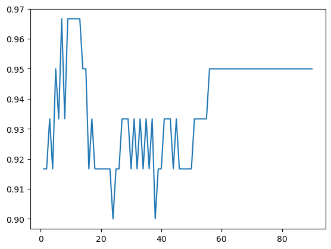
    


```python
"""
Data visualization: in the same plot 
view two kind of weighting of the vote of the neighbours:
uniform and distance
"""
print_decorated("Data visualization",
                "in the same plot view two kind of weighting of the vote of the neighbours: uniform and distance")
X_train, X_test, y_train, y_test = train_test_split(iris.data,
                                                    iris.target,
                                                    test_size=0.4,
                                                    random_state=0)
i = 0
f, (ax1, ax2) = plt.subplots(1, 2, sharey=True)
for weight_type in ['uniform', 'distance']:
    print("weighting:" + str(weight_type))
    # array for storing accuracies
    A = np.zeros(len(y_train), dtype=float)
    best_accuracy = 0
    best_k = 1
    for n_neighbors in np.arange(1, len(y_train) + 1):
        clf_knn2 = neighbors.KNeighborsClassifier(n_neighbors, weights=weight_type)
        clf_knn2.fit(X_train, y_train)
        index = n_neighbors - 1
        A[index] = clf_knn2.score(X_test, y_test)
        if best_accuracy < clf_knn2.score(X_test, y_test):
            best_accuracy = clf_knn2.score(X_test, y_test)
            best_k = n_neighbors

    print("best k=" + str(best_k))
    print("best accuracy=" + str(best_accuracy))
    if i == 0:
        ax1.plot(np.arange(1, len(y_train) + 1), A)
        ax1.set_title('weighting type:' + str(weight_type))
    else:
        ax2.plot(np.arange(1, len(y_train) + 1), A)
        ax2.set_title('weighting type:' + str(weight_type))
    i = i + 1
    print("-------------------------------------------------------------------------")

plt.show()
```

    
    #######################################################################################
    Data visualization :  in the same plot view two kind of weighting of the vote of the neighbours: uniform and distance
    weighting:uniform
    best k=7
    best accuracy=0.9666666666666667
    -------------------------------------------------------------------------
    weighting:distance
    best k=7
    best accuracy=0.9666666666666667
    -------------------------------------------------------------------------
    


    
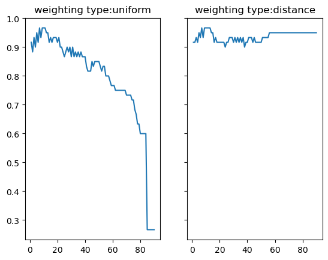
    


```python
"""
Data visualization: in the same PICTURE (GRAPH) 
view two kind of weighting of the vote of the neighbours:
uniform and distance
"""
print_decorated("Data visualization",
                "in the same picture view two kind of weighting of the vote of the neighbours: uniform and distance")

X_train, X_test, y_train, y_test = train_test_split(iris.data, iris.target, test_size=0.4, random_state=0)

fig = plt.figure()
fig.suptitle('Accuracy in k-nn with number of neighbors and types of weighting', fontsize=14, fontweight='bold')
ax = fig.add_subplot(111)
ax.set_xlabel('n. neighbors')
ax.set_ylabel('accuracy')

A = np.zeros((len(y_train), 2), dtype=float)
i = 0
best_accuracy = 0
for weight_type in ['uniform', 'distance']:
    print("weighting:" + str(weight_type))
    best_accuracy = 0
    best_k = 1
    for n_neighbors in np.arange(1, len(y_train) + 1):
        clf_knn2 = neighbors.KNeighborsClassifier(n_neighbors, weights=weight_type)
        clf_knn2.fit(X_train, y_train)
        index = n_neighbors - 1  # computes the matrix row index
        A[index, i] = clf_knn2.score(X_test, y_test)
        if best_accuracy < clf_knn2.score(X_test, y_test):
            best_accuracy = clf_knn2.score(X_test, y_test)
            best_k = n_neighbors

    print("best k=" + str(best_k))
    print("best accuracy=" + str(best_accuracy))
    plt.plot(np.arange(1, len(y_train) + 1), A[:, i])
    i = i + 1
    print("-------------------------------------------------------------------------")

plt.legend(['uniform', 'distance'], loc='lower left')
plt.show()
```

    
    #######################################################################################
    Data visualization :  in the same picture view two kind of weighting of the vote of the neighbours: uniform and distance
    weighting:uniform
    best k=7
    best accuracy=0.9666666666666667
    -------------------------------------------------------------------------
    weighting:distance
    best k=7
    best accuracy=0.9666666666666667
    -------------------------------------------------------------------------
    


    
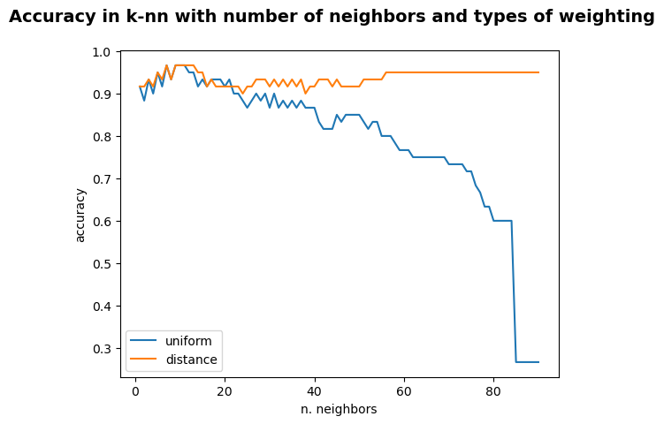
    


```python
"""
EXERCISE 1:
Plot the Iris dataset, in 2-D, with a 
red color for Setosa, 
blu for Versicolor, 
green for Virginica.
show scatter plot (in 2D): choosing 2 of the 4 features
Feature Analysis
features: sepal length(cm), sepal width(cm), petal length (cm), petal width (cm)
choosing a features that contribute the most to the output feature for use in model construction
"""
from sklearn import datasets
import pandas as pd
from sklearn.feature_selection import f_classif
from sklearn.preprocessing import MinMaxScaler
import seaborn as sns
from sklearn.preprocessing import MinMaxScaler

iris = datasets.load_iris()
target = datasets.load_iris().target

features_name = iris.feature_names;
target = iris.target

# convert to dataframe for processing
iris = pd.DataFrame(iris.data, columns = features_name)
print(iris)
# dataset histogram: 50 examplas for each class (0, 1, 2)
print(target)
# plt.hist(target)

# Feature Analysis
# normalize and viusalize feature’s correlations with classes
#to normalize dataset, we use this handy MinMaxScaler
scaler = MinMaxScaler()
scaler.fit(iris)
iris_norm=scaler.transform(iris)
# visualizing features and target
iris_norm = pd.DataFrame(iris_norm, columns = iris.columns)
iris_norm_ = pd.DataFrame(np.hstack((iris_norm, target[:, np.newaxis])), columns = iris.columns.tolist() + ['class'])
sns.pairplot(iris_norm_, hue = 'class', diag_kind='hist')
# Results: can separate 3 classes very clear: sepal width/sepal length.
# Class 1 and class 2 are tangled in the chart
```

         sepal length (cm)  sepal width (cm)  petal length (cm)  petal width (cm)
    0                  5.1               3.5                1.4               0.2
    1                  4.9               3.0                1.4               0.2
    2                  4.7               3.2                1.3               0.2
    3                  4.6               3.1                1.5               0.2
    4                  5.0               3.6                1.4               0.2
    ..                 ...               ...                ...               ...
    145                6.7               3.0                5.2               2.3
    146                6.3               2.5                5.0               1.9
    147                6.5               3.0                5.2               2.0
    148                6.2               3.4                5.4               2.3
    149                5.9               3.0                5.1               1.8
    
    [150 rows x 4 columns]
    [0 0 0 0 0 0 0 0 0 0 0 0 0 0 0 0 0 0 0 0 0 0 0 0 0 0 0 0 0 0 0 0 0 0 0 0 0
     0 0 0 0 0 0 0 0 0 0 0 0 0 1 1 1 1 1 1 1 1 1 1 1 1 1 1 1 1 1 1 1 1 1 1 1 1
     1 1 1 1 1 1 1 1 1 1 1 1 1 1 1 1 1 1 1 1 1 1 1 1 1 1 2 2 2 2 2 2 2 2 2 2 2
     2 2 2 2 2 2 2 2 2 2 2 2 2 2 2 2 2 2 2 2 2 2 2 2 2 2 2 2 2 2 2 2 2 2 2 2 2
     2 2]
    


    <seaborn.axisgrid.PairGrid at 0x2688c673c10>


    
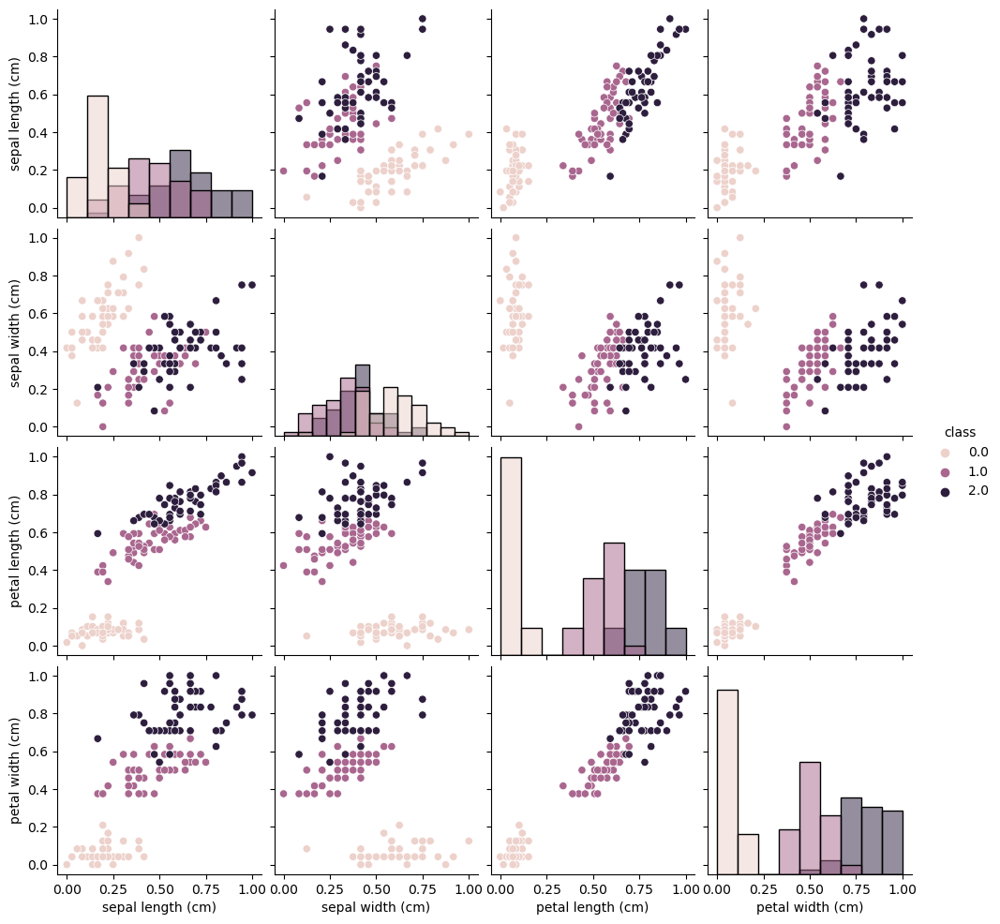
    


```python
"""
Feature Analysis
features: sepal length(cm), sepal width(cm), petal length (cm), petal width (cm)
choosing a features that contribute the most to the output feature for use in model construction
"""
from sklearn.datasets import load_iris
import pandas as pd
from lab_2_utils import print_decorated
from matplotlib import pyplot as plt
import seaborn as sns

iris = load_iris()
df = pd.DataFrame(iris.data)
print(df.head(5))  # print first 5 rows

# add column target
print(iris.target)
df["target"] = iris.target
print(df.head(5))

# checking the correlation with method pearson
corr = df.corr(method='pearson')
print("Checking the correlation with method pearson\n", corr)
corr = df.corr(method='pearson')['target']
print("FEATURES AND TARGET correlation: checking the correlation with method pearson\n", corr)

sns.heatmap(df.corr(method='pearson'), annot=True)
plt.show()
```

         0    1    2    3
    0  5.1  3.5  1.4  0.2
    1  4.9  3.0  1.4  0.2
    2  4.7  3.2  1.3  0.2
    3  4.6  3.1  1.5  0.2
    4  5.0  3.6  1.4  0.2
    [0 0 0 0 0 0 0 0 0 0 0 0 0 0 0 0 0 0 0 0 0 0 0 0 0 0 0 0 0 0 0 0 0 0 0 0 0
     0 0 0 0 0 0 0 0 0 0 0 0 0 1 1 1 1 1 1 1 1 1 1 1 1 1 1 1 1 1 1 1 1 1 1 1 1
     1 1 1 1 1 1 1 1 1 1 1 1 1 1 1 1 1 1 1 1 1 1 1 1 1 1 2 2 2 2 2 2 2 2 2 2 2
     2 2 2 2 2 2 2 2 2 2 2 2 2 2 2 2 2 2 2 2 2 2 2 2 2 2 2 2 2 2 2 2 2 2 2 2 2
     2 2]
         0    1    2    3  target
    0  5.1  3.5  1.4  0.2       0
    1  4.9  3.0  1.4  0.2       0
    2  4.7  3.2  1.3  0.2       0
    3  4.6  3.1  1.5  0.2       0
    4  5.0  3.6  1.4  0.2       0
    Checking the correlation with method pearson
                    0         1         2         3    target
    0       1.000000 -0.117570  0.871754  0.817941  0.782561
    1      -0.117570  1.000000 -0.428440 -0.366126 -0.426658
    2       0.871754 -0.428440  1.000000  0.962865  0.949035
    3       0.817941 -0.366126  0.962865  1.000000  0.956547
    target  0.782561 -0.426658  0.949035  0.956547  1.000000
    FEATURES AND TARGET correlation: checking the correlation with method pearson
     0         0.782561
    1        -0.426658
    2         0.949035
    3         0.956547
    target    1.000000
    Name: target, dtype: float64
    


    
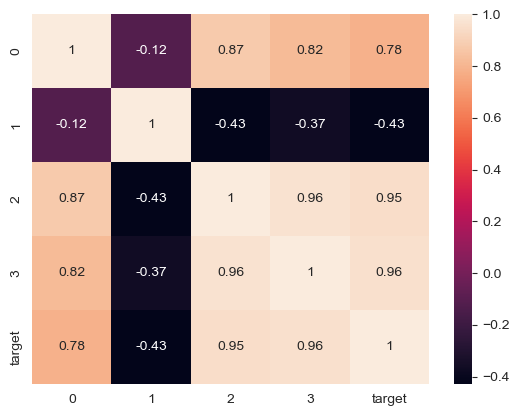
    


```python
"""
feature selection with Chi-Square Testd
test = Summation (Observed Value - Expected Value) / Expected Value
somma(valore osservato - valore atteso) / valore atteso
se il p-value è inferire a 0.05, allora rifiutiamo l'ipotesi nulla
e andiamo con l'ipotesi alternativa
"""
from sklearn.feature_selection import SelectKBest, chi2

# featues Data
X = df.drop("target", axis=1)
# classes/target Data
y = df.target

# chi2 test for features selection (select 2 best features correlation with target Y)
model = SelectKBest(chi2, k=2)
model = model.fit(X, y)

# features 2 and 3: petal length (cm), petal width (cm) 
print("Features data before selection\n", X)
X_after_selection = model.transform(X)
print("Features data after selection\n", X_after_selection)
```

    Features data before selection
            0    1    2    3
    0    5.1  3.5  1.4  0.2
    1    4.9  3.0  1.4  0.2
    2    4.7  3.2  1.3  0.2
    3    4.6  3.1  1.5  0.2
    4    5.0  3.6  1.4  0.2
    ..   ...  ...  ...  ...
    145  6.7  3.0  5.2  2.3
    146  6.3  2.5  5.0  1.9
    147  6.5  3.0  5.2  2.0
    148  6.2  3.4  5.4  2.3
    149  5.9  3.0  5.1  1.8
    
    [150 rows x 4 columns]
    Features data after selection
     [[1.4 0.2]
     [1.4 0.2]
     [1.3 0.2]
     [1.5 0.2]
     [1.4 0.2]
     [1.7 0.4]
     [1.4 0.3]
     [1.5 0.2]
     [1.4 0.2]
     [1.5 0.1]
     [1.5 0.2]
     [1.6 0.2]
     [1.4 0.1]
     [1.1 0.1]
     [1.2 0.2]
     [1.5 0.4]
     [1.3 0.4]
     [1.4 0.3]
     [1.7 0.3]
     [1.5 0.3]
     [1.7 0.2]
     [1.5 0.4]
     [1.  0.2]
     [1.7 0.5]
     [1.9 0.2]
     [1.6 0.2]
     [1.6 0.4]
     [1.5 0.2]
     [1.4 0.2]
     [1.6 0.2]
     [1.6 0.2]
     [1.5 0.4]
     [1.5 0.1]
     [1.4 0.2]
     [1.5 0.2]
     [1.2 0.2]
     [1.3 0.2]
     [1.4 0.1]
     [1.3 0.2]
     [1.5 0.2]
     [1.3 0.3]
     [1.3 0.3]
     [1.3 0.2]
     [1.6 0.6]
     [1.9 0.4]
     [1.4 0.3]
     [1.6 0.2]
     [1.4 0.2]
     [1.5 0.2]
     [1.4 0.2]
     [4.7 1.4]
     [4.5 1.5]
     [4.9 1.5]
     [4.  1.3]
     [4.6 1.5]
     [4.5 1.3]
     [4.7 1.6]
     [3.3 1. ]
     [4.6 1.3]
     [3.9 1.4]
     [3.5 1. ]
     [4.2 1.5]
     [4.  1. ]
     [4.7 1.4]
     [3.6 1.3]
     [4.4 1.4]
     [4.5 1.5]
     [4.1 1. ]
     [4.5 1.5]
     [3.9 1.1]
     [4.8 1.8]
     [4.  1.3]
     [4.9 1.5]
     [4.7 1.2]
     [4.3 1.3]
     [4.4 1.4]
     [4.8 1.4]
     [5.  1.7]
     [4.5 1.5]
     [3.5 1. ]
     [3.8 1.1]
     [3.7 1. ]
     [3.9 1.2]
     [5.1 1.6]
     [4.5 1.5]
     [4.5 1.6]
     [4.7 1.5]
     [4.4 1.3]
     [4.1 1.3]
     [4.  1.3]
     [4.4 1.2]
     [4.6 1.4]
     [4.  1.2]
     [3.3 1. ]
     [4.2 1.3]
     [4.2 1.2]
     [4.2 1.3]
     [4.3 1.3]
     [3.  1.1]
     [4.1 1.3]
     [6.  2.5]
     [5.1 1.9]
     [5.9 2.1]
     [5.6 1.8]
     [5.8 2.2]
     [6.6 2.1]
     [4.5 1.7]
     [6.3 1.8]
     [5.8 1.8]
     [6.1 2.5]
     [5.1 2. ]
     [5.3 1.9]
     [5.5 2.1]
     [5.  2. ]
     [5.1 2.4]
     [5.3 2.3]
     [5.5 1.8]
     [6.7 2.2]
     [6.9 2.3]
     [5.  1.5]
     [5.7 2.3]
     [4.9 2. ]
     [6.7 2. ]
     [4.9 1.8]
     [5.7 2.1]
     [6.  1.8]
     [4.8 1.8]
     [4.9 1.8]
     [5.6 2.1]
     [5.8 1.6]
     [6.1 1.9]
     [6.4 2. ]
     [5.6 2.2]
     [5.1 1.5]
     [5.6 1.4]
     [6.1 2.3]
     [5.6 2.4]
     [5.5 1.8]
     [4.8 1.8]
     [5.4 2.1]
     [5.6 2.4]
     [5.1 2.3]
     [5.1 1.9]
     [5.9 2.3]
     [5.7 2.5]
     [5.2 2.3]
     [5.  1.9]
     [5.2 2. ]
     [5.4 2.3]
     [5.1 1.8]]
    


```python
"""
Plot with SEABORN LIBRARY
Plot the Iris dataset, in 2-D, with a red color for Setosa, blu for Versicolor, green for Virginica.
['setosa' 'versicolor' 'virginica']
features: sepal length(cm), sepal width (cm), petal length (cm), petal width (cm)
features selection: petal length (cm), petal width (cm)
"""
iris = sns.load_dataset('iris')
sns.FacetGrid(iris, hue ="species", height = 6).map(plt.scatter,'petal_length', 'petal_width').add_legend()
```


    <seaborn.axisgrid.FacetGrid at 0x1826d2e5be0>


    
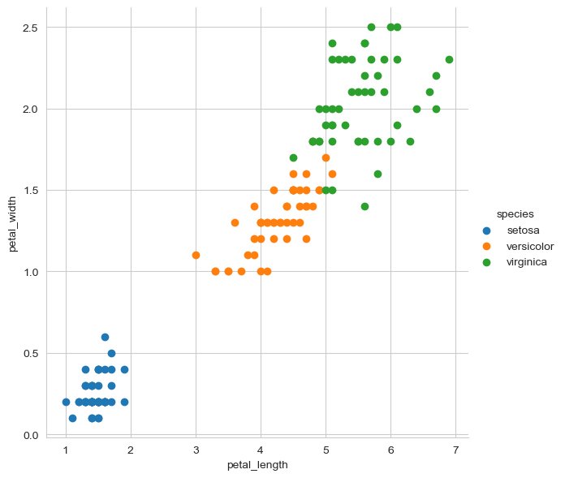
    


```python
"""
Plot with matplotlib
Plot the Iris dataset, in 2-D, with a red color for Setosa, blu for Versicolor, green for Virginica.
['setosa' 'versicolor' 'virginica']
features: sepal length(cm), sepal width (cm), petal length (cm), petal width (cm)
features selection: petal length (cm), petal width (cm)
"""
iris = load_iris()
# The indices of the features that we are plotting (class 0 & 1)
x_index = 2 # petal length (cm)
y_index = 3 # petal width (cm)
# this formatter will label the colorbar with the correct target names
formatter = plt.FuncFormatter(lambda i, *args: iris.target_names[int(i)])
plt.figure(figsize=(5, 4))
plt.scatter(iris.data[:, x_index], iris.data[:, y_index], c=iris.target)
plt.colorbar(ticks=[0, 1, 2], format=formatter)
plt.xlabel(iris.feature_names[x_index])
plt.ylabel(iris.feature_names[y_index])
plt.tight_layout()
plt.show()
```


    
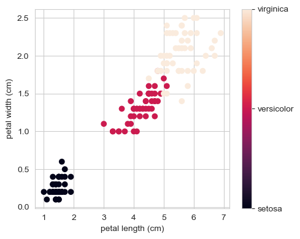
    


```python
"""
EXSERCISE 2
Show a scatter plot similar to the previous one, 
but now the color of the points is determined by the class estimated by k-nn, 
with a value of k of your choice.
"""
from sklearn import neighbors
from sklearn.model_selection import train_test_split
iris = load_iris()
# training set = 90 examples
# test set = 0.4 = 60 examples
X_train, X_test, y_train, y_test = train_test_split(iris.data, iris.target, test_size=0.4, random_state=0)
n_neighbors = 7 # best value of k (maximum accuracy)
# k-nn classification, model fitting and accuracy scoring
clf_knn = neighbors.KNeighborsClassifier(n_neighbors, weights='distance')
clf_knn = clf_knn.fit(X_train, y_train)
print("Accuracy:" , clf_knn.score(X_test, y_test))

# TRAINING SET
print("TRAINING SET (90 examples):")
predicted_classes_training_set = clf_knn.predict(X_train)
print("Predicted classes for 90 examples", predicted_classes_training_set)
# get index of setosa, versicolor and virginica in predicted class array
indices_of_setosa_training = [i for i in range(predicted_classes_training_set.size) if predicted_classes_training_set[i] == 0]
indices_of_versicolor_training = [i for i in range(predicted_classes_training_set.size) if predicted_classes_training_set[i] == 1]
indices_of_virginica_training = [i for i in range(predicted_classes_training_set.size) if predicted_classes_training_set[i] == 2]
# show a scatter plot
plt.figure()
plt.plot(X_train[indices_of_setosa_training,0],X_train[indices_of_setosa_training,1],"ro",label="setosa") # plot x and y using red circle markers
plt.plot(X_train[indices_of_versicolor_training,0],X_train[indices_of_versicolor_training,1],"bo",label="versicolor") # plot x and y using blue circle markers
plt.plot(X_train[indices_of_virginica_training,0],X_train[indices_of_virginica_training,1],"go",label="virgnica") # plot x and y using green circle markers
plt.legend()
plt.show()

# TEST SET
print("----------------------------------------------------------------------------------------------\nTEST SET (60 examples):")
predicted_classes_test_set = clf_knn.predict(X_test)
print("Predicted classes for 60 examples", predicted_classes_test_set)
# get index of setosa, versicolor and virginica in predicted class array
indices_of_setosa_test = [i for i in range(predicted_classes_test_set.size) if predicted_classes_test_set[i] == 0]
indices_of_versicolor_test = [i for i in range(predicted_classes_test_set.size) if predicted_classes_test_set[i] == 1]
indices_of_virginica_test = [i for i in range(predicted_classes_test_set.size) if predicted_classes_test_set[i] == 2]
# show a scatter plot
plt.figure()
plt.plot(X_test[indices_of_setosa_test,0],X_test[indices_of_setosa_test,1],"ro",label="setosa") # plot x and y using red circle markers
plt.plot(X_test[indices_of_versicolor_test,0],X_test[indices_of_versicolor_test,1],"bo",label="versicolor") # plot x and y using blue circle markers
plt.plot(X_test[indices_of_virginica_test,0],X_test[indices_of_virginica_test,1],"go",label="virgnica") # plot x and y using green circle markers
plt.legend()
plt.show()
```

    Accuracy: 0.9666666666666667
    TRAINING SET (90 examples):
    Predicted classes for 90 examples [1 0 2 1 1 1 1 2 0 0 2 1 0 0 1 0 2 1 0 1 2 1 0 2 2 2 2 0 0 2 2 0 2 0 2 2 0
     0 2 0 0 0 1 2 2 0 0 0 1 1 0 0 1 0 2 1 2 1 0 2 0 2 0 0 2 0 2 1 1 1 2 2 1 1
     0 1 2 2 0 1 1 1 1 0 0 0 2 1 2 0]
    


    
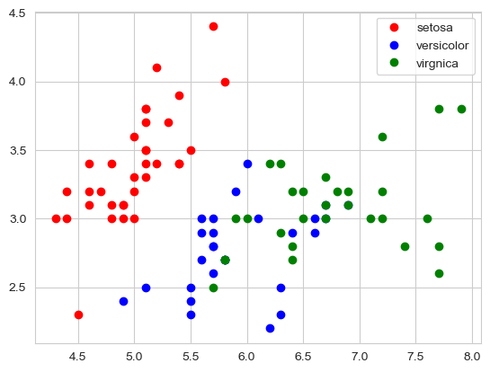
    


    ----------------------------------------------------------------------------------------------
    TEST SET (60 examples):
    Predicted classes for 60 examples [2 1 0 2 0 2 0 1 1 1 2 1 1 1 1 0 1 1 0 0 2 1 0 0 2 0 0 1 1 0 2 1 0 2 2 1 0
     2 1 1 2 0 2 0 0 1 2 2 2 2 1 2 1 1 2 2 1 2 1 2]
    


    
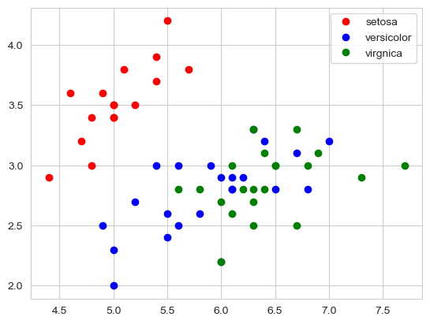
    


```python
"""
EXERCISE 3-4
View the ROC plot of the best decision tree you trained in exercise # 1.
Compare decision trees and k-nn on the ROC space: 
for which values of (TPR, FPR) k-nn is better than decision trees?
"""
from sklearn import tree
from sklearn.metrics import roc_curve
import numpy as np
iris = load_iris()
# training set = 90 examples
# test set = 0.4 = 60 examples
X_train, X_test, y_train, y_test = train_test_split(iris.data, iris.target, test_size=0.4, random_state=0)

# DECISION TREE CLASSIFIER
clf_decision_tree = tree.DecisionTreeClassifier(criterion="entropy",
                                  random_state=300,
                                  min_samples_leaf=5,
                                  class_weight={0: 1, 1: 1, 2: 1})
clf_decision_tree = clf_decision_tree.fit(X_train, y_train)
predictions = clf_decision_tree.predict(X_test)
print("DECISION TREE CLASSIFIER: TEST SET predictions", predictions)
print("DECISION TREE CLASSIFIER: Test Set Accuracy:" , clf_decision_tree.score(X_test, y_test))
# create 3 subplots (rows = 1, column = 3)
fig2, axs = plt.subplots(1, 3, figsize=(15, 5))

# SETOSA (0)
# classes binarization (1, -1): 
# if class is 0 (setosa) set 1, -1 otherwise
# np.where(y_test == classe, 1, -1)
fpr_setosa, tpr_setosa, _ = roc_curve(np.where(y_test == 0, 1, -1), np.where(predictions == 0, 1, -1))
axs[0].plot(fpr_setosa, tpr_setosa, color='orange')
axs[0].set_title(f'ROC curve SETOSA VS others')
axs[0].set(xlabel='FPR', ylabel='TPR')
    
# VERSICOLOR (1)
# classes binarization: if class is 1 (versicolor) set 1, -1 otherwise
fpr_versicolor, tpr_versicolor, _ = roc_curve(np.where(y_test == 1, 1, -1), np.where(predictions == 1, 1, -1))
axs[1].plot(fpr_versicolor, tpr_versicolor, color='blue')
axs[1].set_title(f'ROC curve VERSICOLOR VS others')
axs[1].set(xlabel='FPR', ylabel='TPR')
    
# VIRGINICA (2)
# classes binarization: if class is 2 (virginica) set 1, -1 otherwise
fpr_virginica, tpr_virginica, _ = roc_curve(np.where(y_test == 2, 1, -1), np.where(predictions == 2, 1, -1))
axs[2].plot(fpr_virginica, tpr_virginica, color='green')
axs[2].set_title(f'ROC curve VIRGINICA VS others')
axs[2].set(xlabel='FPR', ylabel='TPR')

print('--------------------------------------------------------------------------------------------')
# k-NN CLASSIFIER
clf_knn = neighbors.KNeighborsClassifier(n_neighbors, weights='distance')
clf_knn = clf_knn.fit(X_train, y_train)
predictions = clf_knn.predict(X_test)
print("k-NN CLASSIFIER: TEST SET predictions", predictions)
print("k-NN CLASSIFIER: Test Set Accuracy:" , clf_knn.score(X_test, y_test)) # bettern than decision tree
# create 3 subplots (rows = 1, column = 3)
fig2, axs = plt.subplots(1, 3, figsize=(15, 5))

# SETOSA (0)
# classes binarization (1, -1): 
# if class is 0 (setosa) set 1, -1 otherwise
# np.where(y_test == classe, 1, -1)
fpr_setosa, tpr_setosa, _ = roc_curve(np.where(y_test == 0, 1, -1), np.where(predictions == 0, 1, -1))
axs[0].plot(fpr_setosa, tpr_setosa, color='orange')
axs[0].set_title(f'ROC curve SETOSA VS others')
axs[0].set(xlabel='FPR', ylabel='TPR')
    
# VERSICOLOR (1)
# classes binarization: if class is 1 (versicolor) set 1, -1 otherwise
fpr_versicolor, tpr_versicolor, _ = roc_curve(np.where(y_test == 1, 1, -1), np.where(predictions == 1, 1, -1))
axs[1].plot(fpr_versicolor, tpr_versicolor, color='blue')
axs[1].set_title(f'ROC curve VERSICOLOR VS others')
axs[1].set(xlabel='FPR', ylabel='TPR')
    
# VIRGINICA (2)
# classes binarization: if class is 2 (virginica) set 1, -1 otherwise
fpr_virginica, tpr_virginica, _ = roc_curve(np.where(y_test == 2, 1, -1), np.where(predictions == 2, 1, -1))
axs[2].plot(fpr_virginica, tpr_virginica, color='green')
axs[2].set_title(f'ROC curve VIRGINICA VS others')
axs[2].set(xlabel='FPR', ylabel='TPR')
```

    DECISION TREE CLASSIFIER: TEST SET predictions [2 1 0 2 0 2 0 1 1 1 2 1 1 1 1 0 1 1 0 0 1 1 0 0 1 0 0 1 1 0 2 1 0 1 2 1 0
     2 1 1 2 0 2 0 0 1 2 2 1 2 1 2 1 1 1 2 1 1 1 2]
    DECISION TREE CLASSIFIER: Test Set Accuracy: 0.8666666666666667
    --------------------------------------------------------------------------------------------
    k-NN CLASSIFIER: TEST SET predictions [2 1 0 2 0 2 0 1 1 1 2 1 1 1 1 0 1 1 0 0 2 1 0 0 2 0 0 1 1 0 2 1 0 2 2 1 0
     2 1 1 2 0 2 0 0 1 2 2 2 2 1 2 1 1 2 2 1 2 1 2]
    k-NN CLASSIFIER: Test Set Accuracy: 0.9666666666666667
    


    [Text(0.5, 0, 'FPR'), Text(0, 0.5, 'TPR')]


    
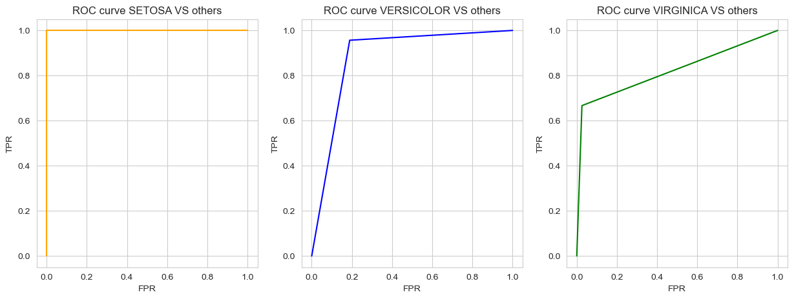
    


    
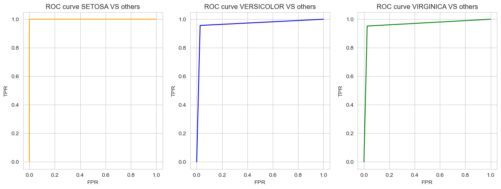
    


```python

```
